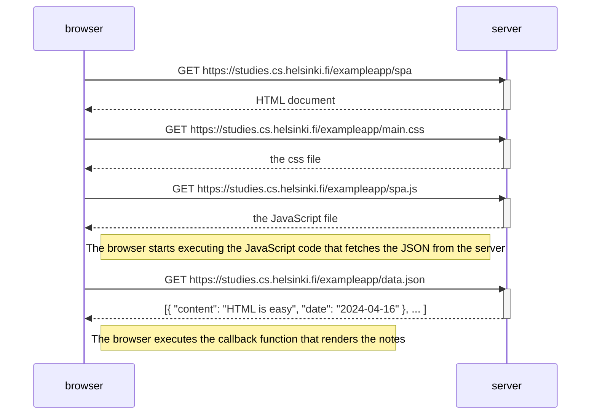

```mermaid
sequenceDiagram
participant b as browser
participant s as server

b->>s: GET https://studies.cs.helsinki.fi/exampleapp/spa
activate s
s-->>b: HTML document
deactivate s

b->>s: GET https://studies.cs.helsinki.fi/exampleapp/main.css
activate s
s-->>b: the css file
deactivate s

b->>s: GET https://studies.cs.helsinki.fi/exampleapp/spa.js
activate s
s-->>b: the JavaScript file
deactivate s

Note right of b: The browser starts executing the JavaScript code that fetches the JSON from the server

b->>s: GET https://studies.cs.helsinki.fi/exampleapp/data.json
activate s
s-->>b: [{ "content": "HTML is easy", "date": "2024-04-16" }, ... ]
deactivate s

Note right of b: The browser executes the callback function that renders the notes
```
