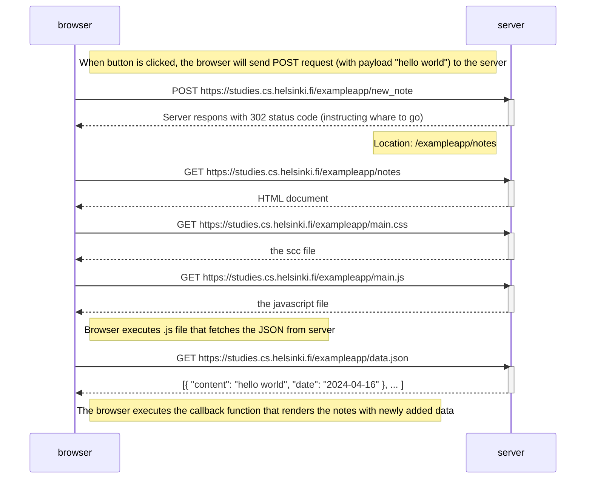

```mermaid
sequenceDiagram
participant b as browser
participant s as server

Note right of b: When button is clicked, the browser will send POST request (with payload "hello world") to the server

b->>s: POST https://studies.cs.helsinki.fi/exampleapp/new_note
activate s
s-->> b: Server respons with 302 status code (instructing whare to go)
deactivate s

Note left of s: Location: /exampleapp/notes

b->>s: GET https://studies.cs.helsinki.fi/exampleapp/notes
activate s
s-->> b: HTML document
deactivate s

b->>s: GET https://studies.cs.helsinki.fi/exampleapp/main.css
activate s
s-->> b: the scc file
deactivate s

b->>s: GET https://studies.cs.helsinki.fi/exampleapp/main.js
activate s
s-->> b: the javascript file
deactivate s

Note right of b: Browser executes .js file that fetches the JSON from server

b->>s: GET https://studies.cs.helsinki.fi/exampleapp/data.json
activate s
s-->> b: [{ "content": "hello world", "date": "2024-04-16" }, ... ]
deactivate s

Note right of b: The browser executes the callback function that renders the notes with newly added data
```
