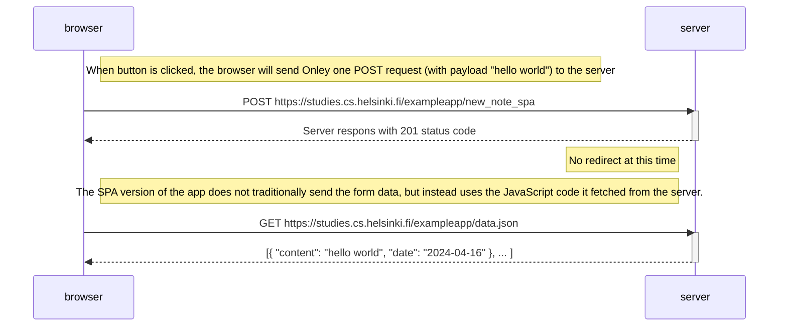

```mermaid
sequenceDiagram
participant b as browser
participant s as server

Note right of b: When button is clicked, the browser will send Onley one POST request (with payload "hello world") to the server

b->>s: POST https://studies.cs.helsinki.fi/exampleapp/new_note_spa
activate s
s-->> b: Server respons with 201 status code
deactivate s

Note left of s: No redirect at this time


Note right of b: The SPA version of the app does not traditionally send the form data, but instead uses the JavaScript code it fetched from the server.

b->>s: GET https://studies.cs.helsinki.fi/exampleapp/data.json
activate s
s-->> b: [{ "content": "hello world", "date": "2024-04-16" }, ... ]
deactivate s
```
